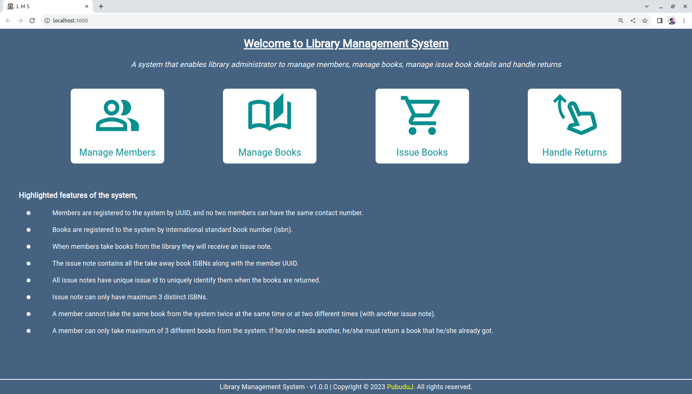
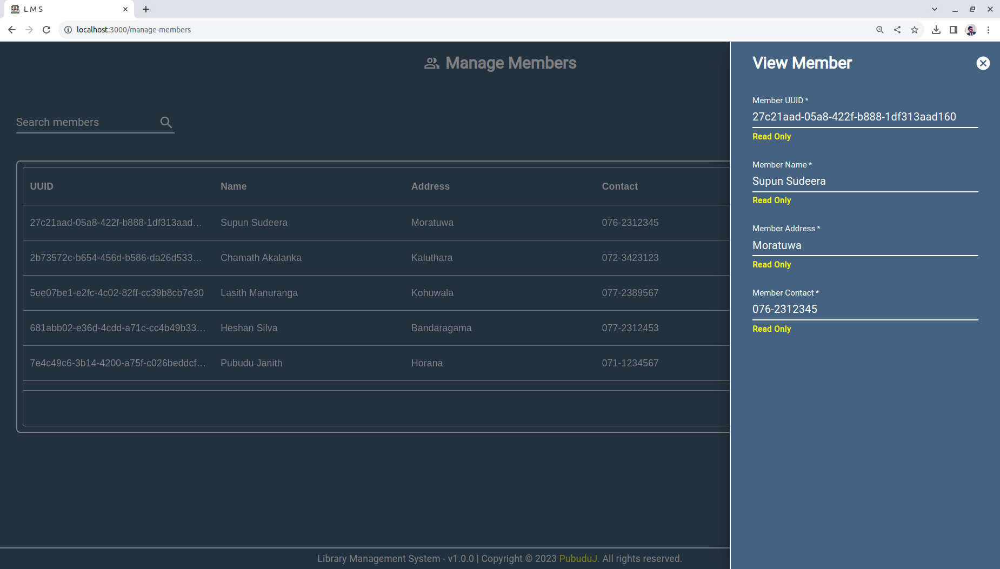
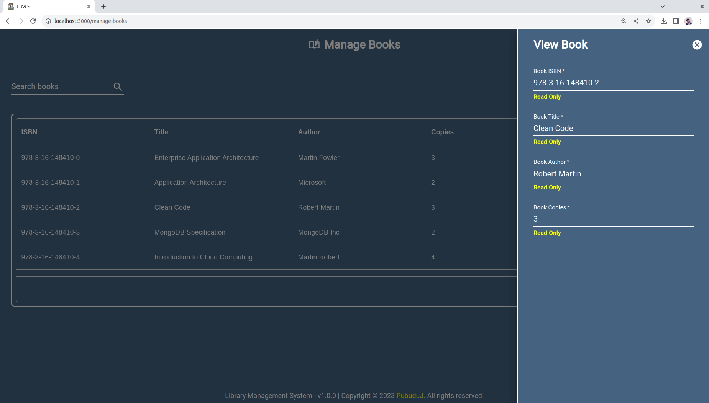
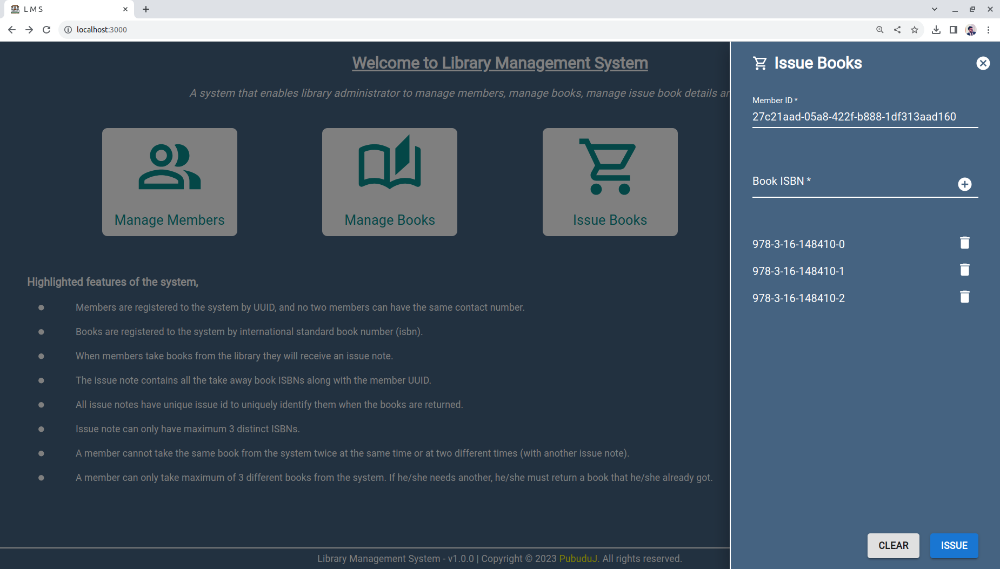
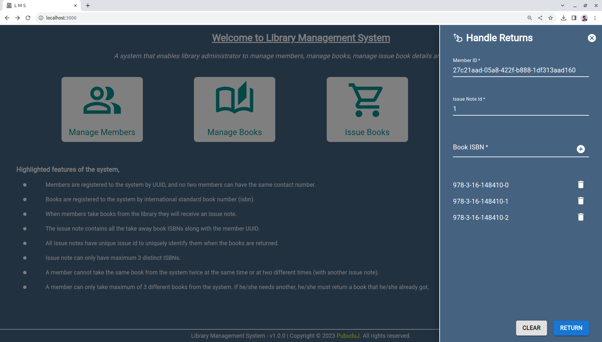

# Library Management System Front End 

This project was bootstrapped with [Create React App](https://github.com/facebook/create-react-app).

This is the **React Front End** of the **library management system.** Highlighted features of the system is as follows,

- Members are registered to the system by [**UUID**](https://en.wikipedia.org/wiki/Universally_unique_identifier), and no two members can have the same contact number.
- Books are registered to the system by international standard book number (isbn).
- When members take books from the library they will receive an issue note.
- The issue note contains all the take away book ISBNs along with the member UUID.
- All issue notes have unique issue id to uniquely identify them when the books are returned.
- Issue note can only have maximum 3 distinct ISBNs.
- A member cannot take the same book from the system twice at the same time or at two different times (with another issue note).
- A member can only take maximum of 3 different books from the system. If he/she needs another, he/she must return a book that he/she already got.

**Jakarta Servlet Back End** of the project can be visited by clicking [**here.**](https://github.com/PubuduJ/library-management-system-back-end) 
**Spring Boot Back End** of the project can be visited by clicking [**here.**](https://github.com/PubuduJ/library-management-system-spring-boot-back-end)

#### Images of the User Interfaces

1. Dashboard 
   

2. Manage Members 
   

3. Manage Books 
   

4. Issue Books 
   

5. Handle Returns 
   

#### Desktop View Demo Video

https://github.com/PubuduJ/library-management-system-front-end/assets/109058596/a08665a5-eb35-42ff-9600-49a3610c684d

#### Mobile View Demo Video

https://github.com/PubuduJ/library-management-system-front-end/assets/109058596/3c646800-5729-4f4d-a4f5-f60acefe823a

## Used Technologies

- React
- MUI
- TypeScript
- React Router
- Axios

#### Used Integrated Development Environment
- IntelliJ IDEA

## How to use ?
- This project can be used by cloning the project to your local computer.
- Clone the project using `https://github.com/PubuduJ/library-management-system-front-end.git` terminal command.
- Execute `npm install` and `npm start` to install the necessary dependencies and run the project.

## Available Scripts

In the project directory, you can run:

### `npm start`

Runs the app in the development mode.\
Open [http://localhost:3000](http://localhost:3000) to view it in your browser.

The page will reload when you make changes.\
You may also see any lint errors in the console.

### `npm test`

Launches the test runner in the interactive watch mode.\
See the section about [running tests](https://facebook.github.io/create-react-app/docs/running-tests) for more information.

### `npm run build`

Builds the app for production to the `build` folder.\
It correctly bundles React in production mode and optimizes the build for the best performance.

The build is minified and the filenames include the hashes.\
Your app is ready to be deployed!

See the section about [deployment](https://facebook.github.io/create-react-app/docs/deployment) for more information.

### `npm run eject`

**Note: this is a one-way operation. Once you `eject`, you can't go back!**

If you aren't satisfied with the build tool and configuration choices, you can `eject` at any time. This command will remove the single build dependency from your project.

Instead, it will copy all the configuration files and the transitive dependencies (webpack, Babel, ESLint, etc) right into your project so you have full control over them. All of the commands except `eject` will still work, but they will point to the copied scripts so you can tweak them. At this point you're on your own.

You don't have to ever use `eject`. The curated feature set is suitable for small and middle deployments, and you shouldn't feel obligated to use this feature. However we understand that this tool wouldn't be useful if you couldn't customize it when you are ready for it.

## Version
v1.0.0

## License
Copyright &copy; 2023 [Pubudu Janith](https://www.linkedin.com/in/pubudujanith/). All Rights Reserved. 
This project is licensed under the [MIT license](LICENSE.txt).
